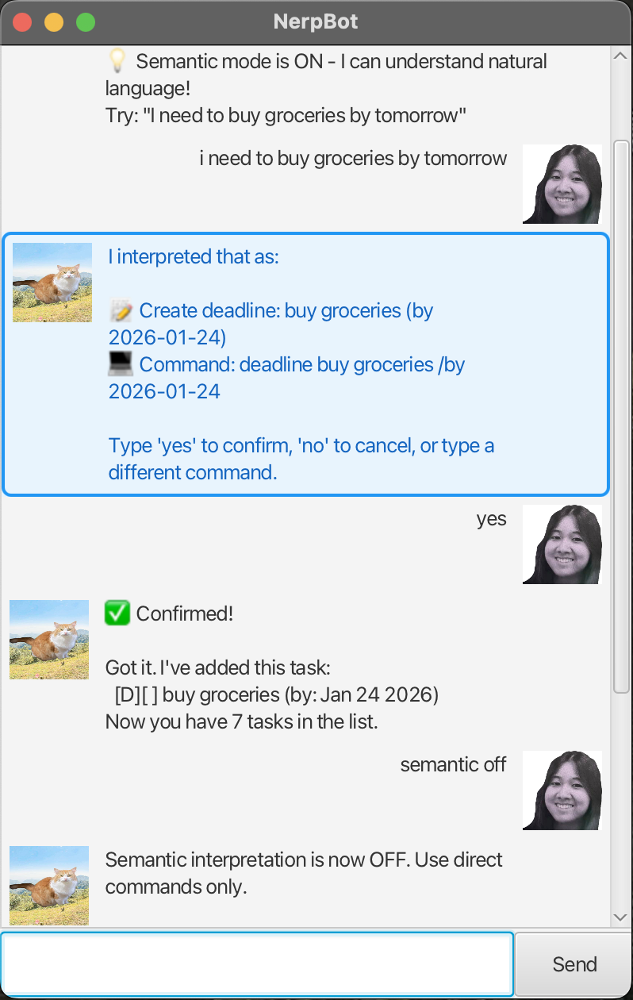

# NerpBot 🤖

> A smart, conversational task manager that understands natural language.

NerpBot is a **desktop task management chatbot** built with Java and JavaFX. It helps you manage todos, deadlines, and events through a friendly chat interface — and now with **semantic interpretation**, you can simply type naturally and let NerpBot figure out what you mean!

---

## 📸 Screenshot




---

## ✨ Features

### Core Task Management
- ✅ **Todo Tasks** — Simple tasks without deadlines
- ✅ **Deadlines** — Tasks with a due date
- ✅ **Events** — Tasks with a start and end time
- ✅ **Mark/Unmark** — Track task completion
- ✅ **Delete** — Remove tasks you no longer need
- ✅ **Find** — Search tasks by keyword
- ✅ **Persistent Storage** — Tasks are saved automatically to `nerpbot.txt`

### 🤖 Semantic Mode (Natural Language Processing)
NerpBot now understands **natural language**! Instead of memorizing commands, just type what you mean:

| You Type | NerpBot Interprets |
|----------|-------------------|
| "I need to buy groceries" | `todo buy groceries` |
| "finish homework by tomorrow" | `deadline finish homework /by 2025-01-24` |
| "meeting from 2pm to 4pm" | `event meeting /from 2pm /to 4pm` |
| "show me all my tasks" | `list` |
| "task 1 is done" | `mark 1` |
| "remove task 2" | `delete 2` |
| "search for homework" | `find homework` |

NerpBot will interpret your input and **ask for confirmation** before executing — so you're always in control!

Toggle semantic mode with:
- `semantic on` — Enable natural language interpretation (default)
- `semantic off` — Use direct commands only

### User Experience
- 🎨 Clean, modern GUI built with JavaFX
- 💬 Chat-style interface with user and bot avatars
- 📜 Auto-scrolling dialog
- ❌ Clear error messages with visual feedback
- 🔵 Confirmation prompts for interpreted commands
- 📖 Built-in help window (`help` command)

---

## 🛠 Commands Reference

### Direct Commands
| Command | Description | Example |
|---------|-------------|---------|
| `todo <desc>` | Add a todo task | `todo buy milk` |
| `deadline <desc> /by <date>` | Add a deadline | `deadline essay /by 2025-02-01` |
| `event <desc> /from <start> /to <end>` | Add an event | `event meeting /from 2pm /to 4pm` |
| `list` | Show all tasks | `list` |
| `mark <n>` | Mark task n as done | `mark 1` |
| `unmark <n>` | Mark task n as not done | `unmark 1` |
| `delete <n>` | Delete task n | `delete 3` |
| `find <keyword>` | Search for tasks | `find book` |
| `help` | Open help window | `help` |
| `bye` | Exit the application | `bye` |

### Semantic Mode Commands
| Command | Description |
|---------|-------------|
| `semantic on` | Enable natural language interpretation |
| `semantic off` | Disable natural language interpretation |

---

## 🧰 Tech Stack

- **Java 17** — Core language
- **JavaFX 17** — GUI framework
- **Gradle** — Build automation
- **JUnit 5** — Testing framework
- **Checkstyle** — Code quality enforcement

---

## 🚀 Getting Started

### Prerequisites
- Java 17 or higher
- Gradle 7.x (or use the included wrapper)

### Installation

1. **Clone the repository**:
   ```bash
   git clone https://github.com/your-username/nerpbot.git
   cd nerpbot
   ```

2. **Run the application**:
   ```bash
   ./gradlew run
   ```

3. **Build a distributable JAR**:
   ```bash
   ./gradlew clean shadowJar
   ```

4. **Run the JAR**:
   ```bash
   java -jar build/libs/nerpbot.jar
   ```

### Development

- **Run tests**:
  ```bash
  ./gradlew test
  ```

- **Check code style**:
  ```bash
  ./gradlew checkstyleMain checkstyleTest
  ```

---

## 📁 Project Structure

```
NerpBot/
├── src/
│   ├── main/
│   │   ├── java/nerpbot/
│   │   │   ├── NerpBot.java          # Main bot logic
│   │   │   ├── Parser.java           # Command parsing
│   │   │   ├── SemanticInterpreter.java  # NLP interpretation
│   │   │   ├── Storage.java          # File I/O
│   │   │   ├── TaskList.java         # Task management
│   │   │   ├── Ui.java               # User interface logic
│   │   │   ├── gui/                  # JavaFX controllers
│   │   │   └── task/                 # Task models
│   │   └── resources/
│   │       ├── images/               # Avatar images
│   │       └── view/                 # FXML layouts
│   └── test/                         # Unit tests
├── data/                             # Task storage
├── docs/                             # Documentation
└── build.gradle                      # Build configuration
```

---

## 🤝 Contributing

Contributions are welcome! Please feel free to submit a Pull Request.

1. Fork the repository
2. Create your feature branch (`git checkout -b feature/AmazingFeature`)
3. Commit your changes (`git commit -m 'Add some AmazingFeature'`)
4. Push to the branch (`git push origin feature/AmazingFeature`)
5. Open a Pull Request

---

## 📄 License

This project is for educational purposes as part of CS2103T Software Engineering.

---

## 🙌 Acknowledgements

- [SE-EDU](https://se-education.org/) — JavaFX tutorials and Duke chatbot framework
- [CS2103T](https://nus-cs2103-ay2425s2.github.io/website/) — Software Engineering course at NUS
