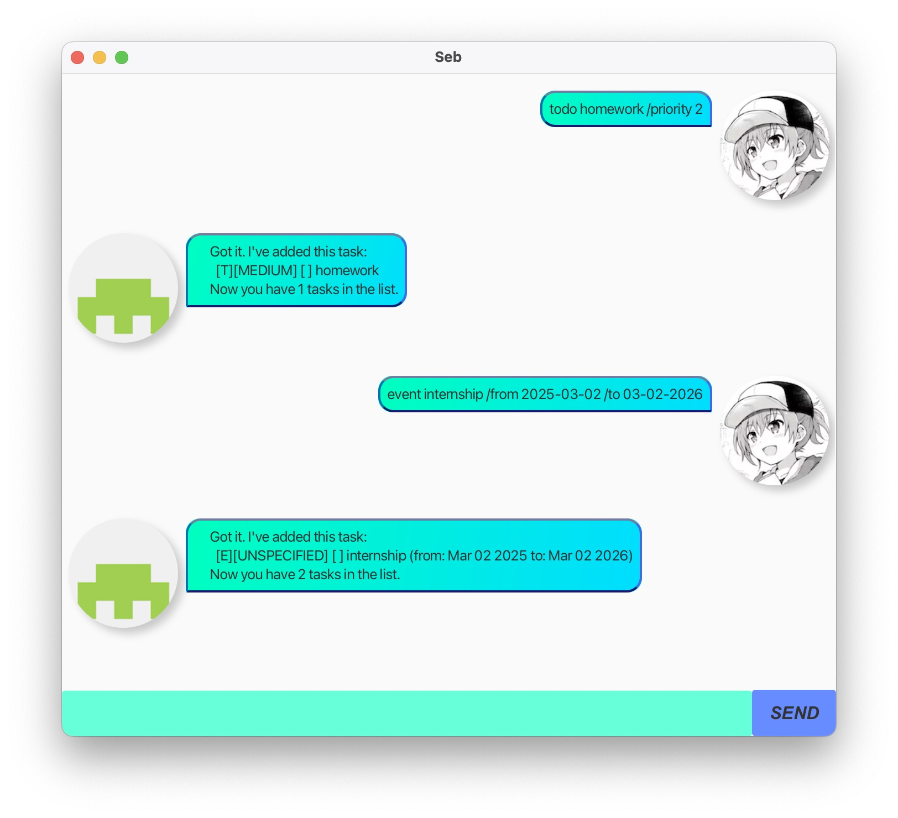

# Seb: A Task Management Bot

This is individual project for CS2103T Software Engineering, AY2025/26 Semester 2 for NUS Computer Science.

## Versions
| versions                                                        | date   | description                      |
|-----------------------------------------------------------------|--------|----------------------------------|
| [v0.2](https://github.com/FisherSkyi/ip/releases/tag/A-Release) | 2025-9 | GUI, priority feature, better Ui |
| [v0.11](https://github.com/FisherSkyi/ip/releases/tag/Level-10) | 2025-9 | initial GUI                      |
| [v0.1](https://github.com/FisherSkyi/ip/releases/tag/A-Jar )    | 2025-8 | CLI backbone                     | 

## User Guide
[Github Page](https://fisherskyi.github.io/ip/)

### Ui Image


### Testing GitHub Pages site locally with Jekyll
1. Ensure you have Ruby and Jekyll installed on your machine. Follow the [Jekyll installation guide](https://jekyllrb.com/docs/installation/) if needed.
2. run the following command in the *root* directory of the project:
   ```bash
   bundle install
   bundle exec jekyll serve --source docs
   ```
3. Open your web browser and navigate to `http://localhost:4000` to view

Hope you like it. :whale2:
