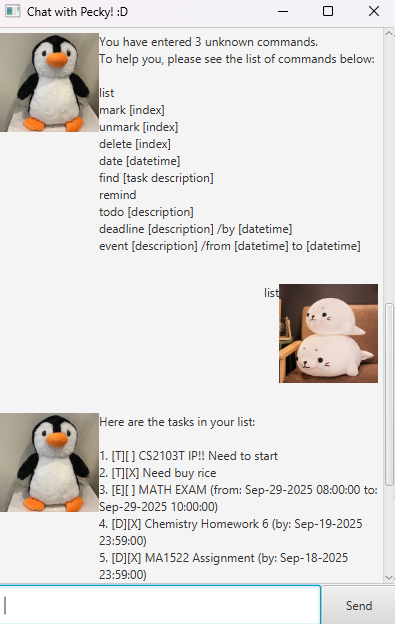

# Sora User Guide

Sora Chatbot

Sora is a simple task management chatbot that helps you keep track of your todos, deadlines, afters and events through a friendly CLI or GUI interface.

---

## 🚀 Getting Started

### Prerequisites
- Java 17 or above installed on your machine.

### Running Duke
1. Clone this repository.
2. Compile the code:
   ```bash
   javac -classpath src -d bin src/**/*.java
   ```
3. Run the chatbot:
   ```bash
   java -classpath bin Sora
   ```
4. A GUI window will open, and you can start typing commands.

---

## ✨ Features

### 1. Add a Todo
```text
todo TASK_DESCRIPTION
```
Example:
```text
todo read book
```

### 2. Add a Deadline
```text
deadline TASK_DESCRIPTION /by yyyy-mm-dd HHmm
```
Example:
```text
deadline return book /by 2019-10-15 2359
```

### 3. Add an After
```text
after TASK_DESCRIPTION /required yyyy-mm-dd HHmm
```
Example:
```text
after return book /required 2019-10-15 2359
```

### 4. Add an Event
```text
event TASK_DESCRIPTION /from yyyy-mm-dd HHmm /to yyyy-mm-dd HHmm
```
Example:
```text
event project meeting /from 2019-08-06 1400 /to 2019-08-06 1600
```

### 5. List All Tasks
```text
list
```

### 6. Mark/Unmark a Task
```text
mark INDEX
unmark INDEX
```
Example:
```text
mark 2
```

### 7. Delete a Task
```text
delete INDEX
```
Example:
```text
delete 1
```

### 8. Find Tasks by Keyword
```text
find KEYWORD
```
Example:
```text
find book
```

---

## 📝 Example Session

```text
Hello! I'm Sora
What can I do for you today?
todo read book
Got it. I've added this task:
  [T][ ] read book
Now you have 1 task in the list.
list
Here are the tasks in your list:
1. [T][ ] read book
bye
Bye. Hope to see you again soon!
```

---

## 📸 Screenshot

