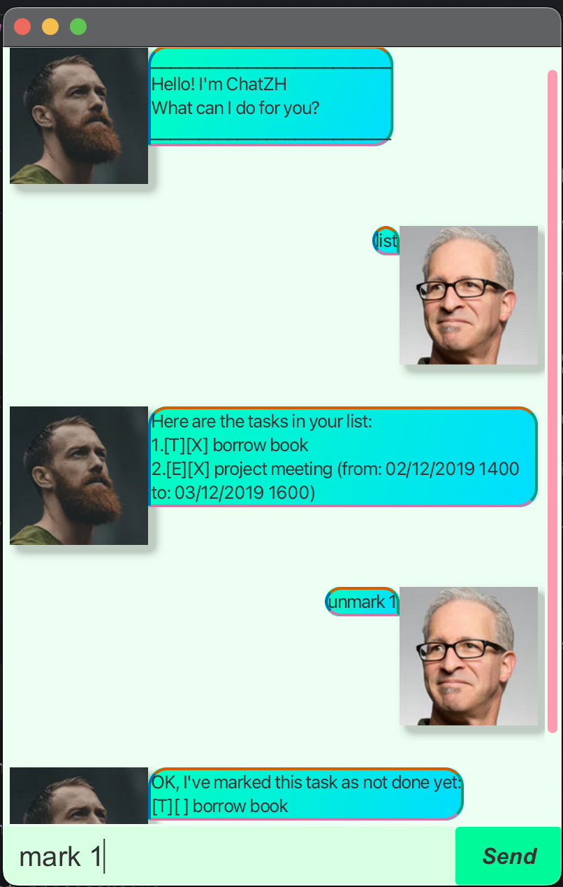

# ChatZh User Guide



ChatZh is a simple, friendly chatbot that helps you track your tasks.
You can add to-dos, deadlines, and events; list them; mark/unmark as done; edit times; delete; and find tasks.

## Quick Start
- Type commands into the input box in the app window.
- Dates and times support common formats like `dd/MM/yyyy HH:mm`, `d/M/yyyy HH:mm`, and date-only forms like `dd/MM/yyyy`.

---

## Features and Examples

### Add a To-do
- **Command**: `todo DESCRIPTION`
- **Example**: `todo Read book`
- **Output**:
```
Got it. I've added this task:
[T][ ] Read book
Now you have 1 tasks in the list.
```

### Add a Deadline
- **Command**: `deadline DESCRIPTION /by DEADLINE`
- Use `/by` to specify the due date/time.
- **Examples**:
    - `deadline Submit report /by 09/09/2025 23:59`
    - `deadline Pay bills /by 9/9/2025`
- **Output** (example):
```
Got it. I've added this task:
[D][ ] Submit report (by: 09/09/2025 23:59)
Now you have 2 tasks in the list.
```

### Add an Event
- **Command**: `event DESCRIPTION /from START /to END`
- Use `/from` and `/to` to specify start and end.
- **Example**: `event Team meeting /from 10/09/2025 10:00 /to 10/09/2025 11:00`
- **Output**:
```
Got it. I've added this task:
[E][ ] Team meeting (from: 10/09/2025 10:00 to: 10/09/2025 11:00)
Now you have 3 tasks in the list.
```

### List Tasks
- **Command**: `list`
- **Output** (example):
```
Here are the tasks in your list:
1.[T][ ] Read book
2.[D][ ] Submit report (by: 09/09/2025 23:59)
3.[E][ ] Team meeting (from: 10/09/2025 10:00 to: 10/09/2025 11:00)
```

### Mark a Task as Done
- **Command**: `mark INDEX`
- **Example**: `mark 1`
- **Output**:
```
Nice! I've marked this task as done:
[T][X] Read book
```

### Unmark a Task
- **Command**: `unmark INDEX`
- **Example**: `unmark 1`
- **Output**:
```
OK, I've marked this task as not done yet:
[T][ ] Read book
```

### Edit Time
Update times for deadlines and events.
- For deadlines: set a new `/by` time with `edit INDEX NEW_TIME`
    - **Example**: `edit 2 10/09/2025 12:00`
- For events: edit the `start` or `end` time with `edit INDEX start NEW_TIME` or `edit INDEX end NEW_TIME`
    - **Examples**:
        - `edit 3 start 10/09/2025 09:30`
        - `edit 3 end 10/09/2025 11:30`
- **Output** (example):
```
Got it. I've updated the time for:
[D][ ] Submit report (by: 10/09/2025 12:00)
```

### Delete a Task
- **Command**: `delete INDEX`
- **Example**: `delete 1`
- **Output**:
```
Noted. I've removed this task:
[T][ ] Read book
Now you have 2 tasks in the list.
```

### Find Tasks
- **Command**: `find KEYWORD`
- **Example**: `find report`
- **Output** (example):
```
Here are the matching tasks in your list:
1.[D][ ] Submit report (by: 10/09/2025 12:00)
```

---

### Notes
- Index numbers refer to the numbers shown in `list`.
- If a description or time is missing or malformed, ChatZh will show a helpful error message.

### Acknowledgement
- UI built with the help of: https://se-education.org/guides/tutorials/javaFx.html
