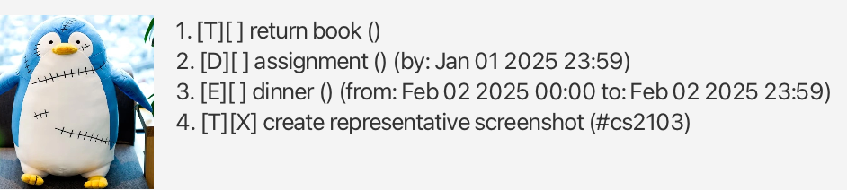
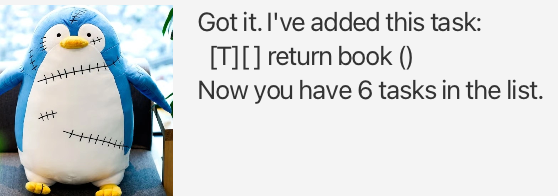
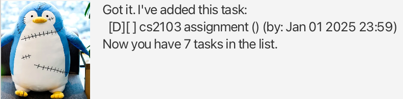
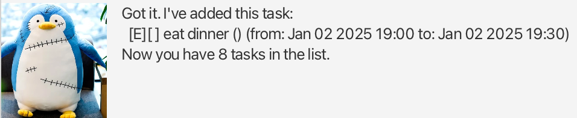
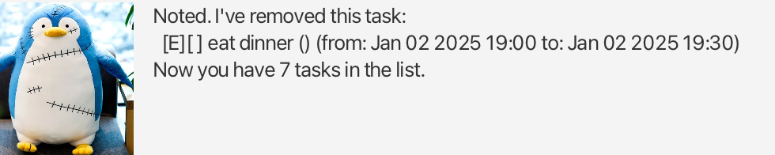
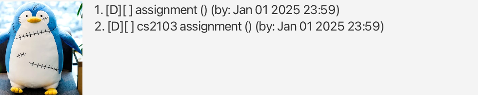
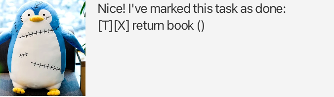
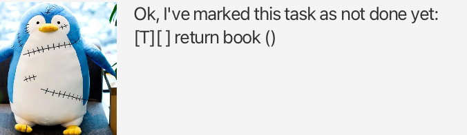

# Waddles User Guide

Waddles is a CLI chatbot that helps you manage your tasks!

Waddles supports 3 types of tasks - todos, deadlines (must complete by some time),
and events (starts and ends at some time).

You can mark tasks as done / undone. You can also tag tasks with tags.

# Features

In the formats below, words in angled brackets denote arguments to be supplied by the user.
For example, `<task_index>` indicates that the user should replace that with an integer index.

## List Tasks

Lists all tasks.

Format: `list`

Example Output:

## Adding Tasks

Adds a task to your list of tasks. Note that each task type has its own format.

Formats: \
`todo <task_description>` \
`deadline <task_description> /by <yyyy-MM-dd HH:mm>` \
`event <task_description> /from <yyyy-MM-dd HH:mm> /to <yyyy-MM-dd HH:mm>`

Examples: \
`todo return book` \
`deadline cs2103 assignment /by 2025-01-01 23:59` \
`event eat dinner /from 2025-01-02 19:00 /to 2025-01-02 19:30`

Example Outputs:

## Deleting Tasks

Deletes a task.

Format: `delete <task_index>`

Example: `delete 8`

Example Output:

## Finding a Task

Search for a task by some substring within the task description.

Format: `find <search_string>`

Example: `find assignment`

Example Output:

## Mark / Unmark Tasks

Mark (as done) or unmark (as not done) a task.

Formats: \
`mark <task_index>` \
`unmark <task_index>`

Examples: \
`mark 1` \
`unmark 1`

Example Outputs:

## Tag / Untag Tasks

Add/remove a tag to/from a task. Note that a task can have multiple tags.

Formats: \
`tag <task_index> <tag_description>`\
`untag <task_index> <tag_description>`

Examples: \
`tag 1 #library`\
`untag 1 #library`

Example Output:

## Exiting

Say bye to Waddles and exits the application.

Format: `bye`

