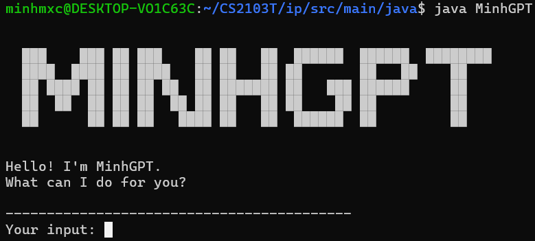

# MinhGPT User Guide



#### MinhGPT is a chatbot to help you manage your tasks

## Getting started

1. Clone the repo
2. Navigate to the root of the project
3. Run `javac -cp ./src/main/java -Xlint:none -d ./bin ./src/main/java/*.java` to compile the program
4. Navigate to `PROJECT_ROOT/bin` folder
5. Run `java MinhGPT` to run the program

## Testing

Nagivate to `PROJECT_ROOT/text-ui-test` and run `./runtest.sh` to run the test suites and verify that the program works as intended.

## Features

### Task Types

**Todo**: tasks without any date/time attached to it *e.g., visit new theme park*

**Deadline**: tasks that need to be done before a specific date/time *e.g., submit report by 11/10/2019 5pm

**Event**: tasks that start at a specific date/time and ends at a specific date/time
*e.g., (a) team project meeting 2/10/2019 2-4pm (b) orientation week 4/10/2019 to 11/10/2019*

### Possible actions

* **Add** tasks
* **Mark** tasks (as done)
* **Unmark** tasks (mark it as undone)
* **Delete** tasks
* **List** all tasks

## Task display format

`[TYPE][STATUS] NAME (EXTRA)`

`TYPE` is the type of the task: `T` for Todo tasks, `D` for deadline tasks and `E` for Event tasks

`STATUS` is the status of the task: `X` for completed tasks, ` `&nbsp;(empty) for uncompleted tasks

`NAME` is the name of the task

`EXTRA` is addtional information about the task: none for Todo task, **deadline** for Deadline tasks, and **time period** for Event tasks

## Usage

### Add Todo task

Type 'todo', followed by name of the task

Example: ```todo task1```

Expected output: ```(˶ᵔ ᵕ ᵔ˶) Added: [T][ ] task1```

### Add Deadline task

Follow this input format `deadline NAME /by TIME`, where `NAME` is the name of the task and `TIME` is the deadline for the task

Example: ```deadline task1 /by Sunday```

Expected output: ```(˶ᵔ ᵕ ᵔ˶) Added: [D][ ] task1 (by: Sunday)```

### Add Event task

Follow this input format `event NAME /from FROM /to TO`, where `NAME` is the name of the task, `FROM` is the **start** time for the event and `TO` is the **end** time for the event

Example: ```event task1 /from Monday 12:00AM /to Friday 23:59PM```

Expected output: ```(˶ᵔ ᵕ ᵔ˶) Added: [E][ ] task1 (from: Monday 12:00AM to: Friday 23:59PM)```

### Mark task

Follow this input format `mark INDEX`, where `INDEX` is the index of the task in the list.

Example: `mark 1`

Expected output: 
```
(˵˃ ᗜ ˂˵) Congrats on finishing the task.
[T][X] task1
```

### Unmark task

Follow this input format `unmark INDEX`, where `INDEX` is the index of the task in the list.

Example: `unmark 1`

Expected output: 
```
(¬`‸´¬) Huh? Why did you lie?
[T][ ] task1
```

### Delete task

Follow this input format `delete INDEX`, where `INDEX` is the index of the task in the list.

Example: `delete 1`

Expected output: `(˶ᵔ ᵕ ᵔ˶) Removed: [T][ ] task1`

### List all tasks

Type 'list'

Example: `list`

Expected output: 
```
(˶˃ ᵕ ˂˶) Here are the list of tasks. You have 2 in total.
1.[D][ ] task1 (by: Sunday)
2.[E][ ] task1 (from: Monday 12:00AM to: Friday 23:59PM)
```